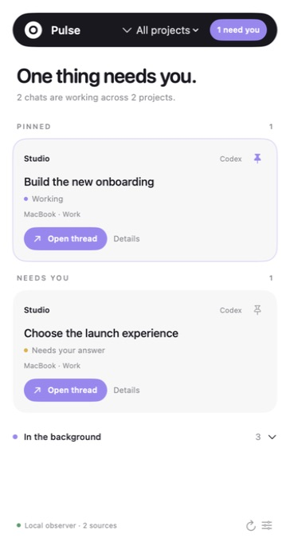
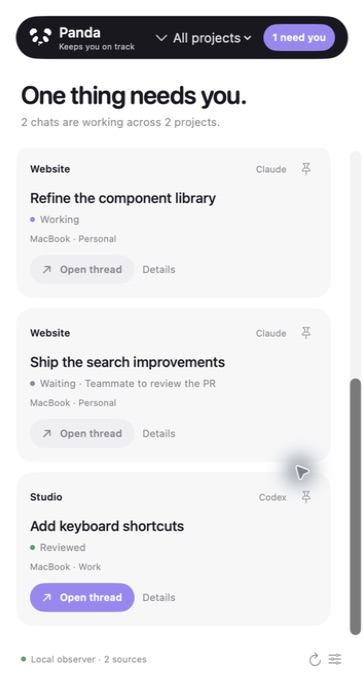
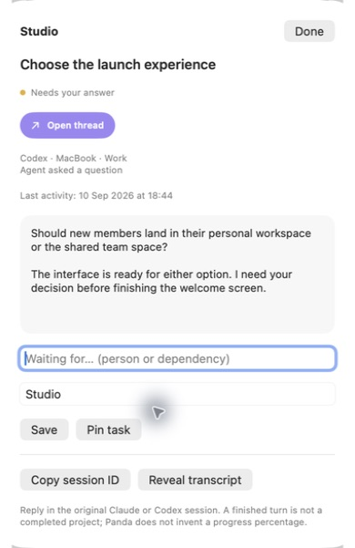
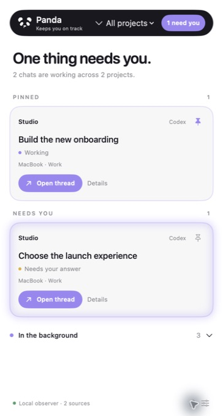

# Panda

**Keeps you on track**

Panda is a small native macOS panel for people working across Claude Code and Codex conversations. It gathers observed activity into one place, groups tasks by repository, and brings questions and finished turns to your attention. Keep it beside your work, pin what matters, and jump back into a supported conversation when it is time to respond.

Previously called Pulse. Existing settings and pins carry over.

**Current version: 0.2.2 · Public preview · Apple Silicon · macOS 13+**

<p align="center">
  
</p>

*Real app interface with fictional sample tasks. Screenshots illustrate the UI; they are not evidence of live account or remote-machine connections.*

## Why Panda exists

When several agents are working at once, checking on them becomes a task of its own. One chat is still running. Another has a question. A third has finished and needs review. A fourth is waiting for someone else to approve a pull request. Those conversations may be spread across projects, profiles and computers.

Panda gives that scattered work a small, persistent home. Its purpose is to reduce repeated checking and make the next thing that needs your attention visible. Routine status comes from observed session activity, so there is no separate task board to keep up to date. Pins and waiting notes add your own priorities when needed.

## What you can do

- **See what needs you.** Observed questions and newly completed turns surface in an attention list. Acknowledging a result clears that turn; a later completion can surface again.
- **Notice the newest arrival.** The latest task needing attention gets a soft lavender edge glow for 30 seconds, with a slow breathing cycle and a gentle fade. Regular refreshes do not restart it.
- **Keep important work pinned.** Pins stay above the attention list and survive relaunches.
- **Glance at work in progress.** Expand the background section for active, waiting, reviewed and uncertain tasks.
- **Group by project.** Repository identities bring related conversations together. Filter by project and give it a friendlier display name.
- **Return to the conversation.** Open supported local Codex tasks and mapped Claude desktop sessions. Unavailable Claude links are disabled.
- **Understand a wait.** Read the latest excerpt, add a person or dependency note, and optionally check linked GitHub pull requests using your existing CLI login.
- **Keep the panel nearby.** Move or resize it, keep it above other windows, and reopen it from the macOS menu bar.

### A quiet visual language

| Status dot | Meaning |
| --- | --- |
| Lavender | Active work observed |
| Yellow | Needs your attention, such as a question or a result to review |
| Green | A finished or reviewed turn |
| Grey | Waiting, idle, interrupted or uncertain activity |

Labels accompany the dots. Cards stay neutral, and lavender controls use white text.

## A closer look

<table>
  <tr>
    <td valign="top"></td>
    <td valign="top"></td>
  </tr>
  <tr>
    <td><strong>Work in the background.</strong> See what is active and what is waiting.</td>
    <td><strong>Context when you need it.</strong> Read the question and return to its original conversation.</td>
  </tr>
</table>

### The newest notification

<p align="center">
  
</p>

The newest attention item glows softly for 30 seconds, with an eight-second breathing cycle and a gentle fade. This still image captures the glow in Panda 0.2.1; the pin above it keeps its usual subtle outline.

All screenshots use sample data. [Screenshot notes](docs/screenshots/README.md).

## How it works

Panda reads accessible Claude Code and Codex session logs and converts recent events into task status. Repository information provides project grouping. Preferences, pins and a small cache stay in Panda's own local data folder.

Additional profile folders can be labelled in Connections. A collector can also return snapshots from another Mac over an existing trusted SSH connection. Accounts remain signed in on their original machines; Panda does not require their passwords.

**This preview is an activity observer.** It does not start, stop or approve agent work. A finished turn is not a completed project, and Panda does not calculate a project completion percentage. If recent activity stops providing reliable evidence, it shows uncertainty.

## Get started

You need an Apple Silicon Mac running macOS 13 or later, and the full Xcode toolchain.

```sh
git clone https://github.com/pippo-wtf/panda.git
cd panda
bash scripts/package.sh
open dist/Panda.app
```

Panda begins with the default local Claude Code and Codex profile folders. Use the sliders icon at the bottom right to add other profile folders or configure a trusted remote Mac.

The app is locally ad-hoc signed; this preview has no notarized installer or automatic updater. Build time depends on your machine.

[Full setup guide, remote Mac instructions and test commands →](docs/GETTING_STARTED.md)

## Current scope

Local collection, the floating panel, repository grouping, pins and supported thread links are implemented. The latest source test suite passed **31 tests**; [validation notes](VALIDATION.md) distinguish fixture checks from live verification.

Some important boundaries:

- Ordinary **Claude Chat and Cowork are not connected**. Claude Code and compatible desktop session logs are the current sources.
- Profiles are labelled folders, not verified billing accounts. Universal four-account sign-in and automatic account discovery are not implemented.
- Remote snapshots are implemented, but a real second-machine acceptance run and all four account/profile combinations remain unverified.
- Passive logs can miss or delay permission prompts, queue events and some questions. They do not prove process liveness.
- GitHub enrichment is optional and limited to linked pull requests. Full PR discovery and project milestone tracking are not included.

[Complete coverage and limits →](docs/COVERAGE.md)

## Your data

Provider folders are read only. Panda does not change Claude/Codex credentials, hooks or settings. Preferences and the pinned-task cache live in `~/Library/Application Support/Pulse`.

When you configure a remote Mac, its task metadata and recent excerpts travel to the panel Mac over SSH. Optional GitHub checks use the existing `gh` login and linked PR API requests; chat excerpts are not sent to GitHub or NotebookLM. The diagnostic export contains aggregate counts rather than task text.

## Help improve Panda

Found a status that looks wrong or a link that will not open? [Open an issue](https://github.com/pippo-wtf/panda/issues/new/choose) with what you expected, what happened, and the relevant app versions. Remove private chat text and account details from anything you attach.

[Contributing and development guide](CONTRIBUTING.md) · [Navigation behavior](NAVIGATION.md) · [Validation history](VALIDATION.md)

This repository is a public preview. No open-source license has been granted in this repository.

## Research provenance

The research compared [Jarvis](https://github.com/Sergey-Chernyshev/jarvis), [AgentBar](https://github.com/michalstrnadel/AgentBar) and [so-agentbar](https://github.com/sotthang/so-agentbar), plus official Claude/Codex documentation. This implementation is a small independent Swift package based on observed local log records; it does not vendor those projects or inherit their deployment claims. Private research notes, session snapshots and design-workspace files are excluded from this repository.
